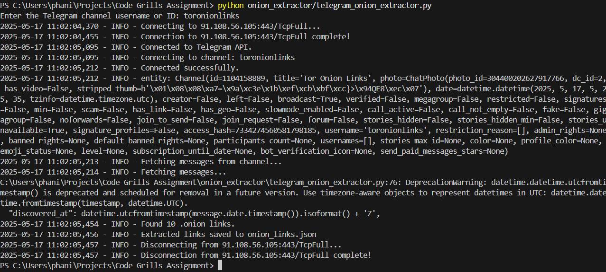
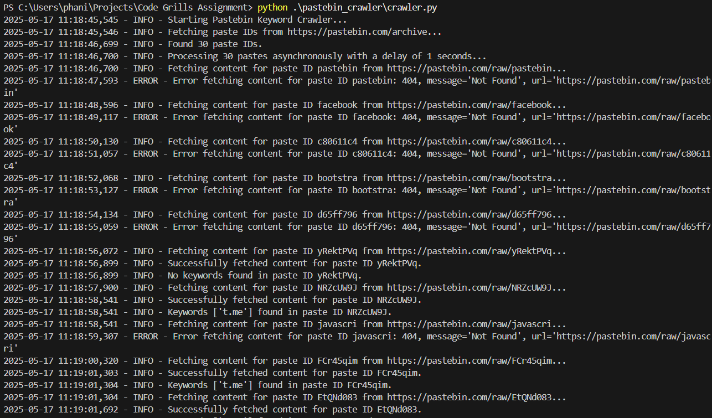

# Code Grills Assignment

This repository contains two Python scripts:

1.  **Telegram .onion Link Extractor:** Connects to a specified Telegram channel, extracts messages, and searches for .onion links.
2.  **Pastebin Keyword Crawler:** Scrapes Pastebin's public archive for pastes containing specific keywords.

## Project Structure

```
.
├── .env
├── .gitignore
├── anon.session
├── crawler.log
├── extractor.log
├── keyword_matches.jsonl
├── onion_links.json
├── onion_extractor/
│   ├── README.md
│   └── telegram_onion_extractor.py
└── pastebin_crawler/
    ├── README.md
    └── crawler.py
```

## Telegram .onion Link Extractor

This script uses the Telethon library to connect to a Telegram channel and extract messages. It then searches for .onion links within these messages and saves the found links to `onion_links.json`.

### Requirements

*   Python 3.7 or higher
*   Telethon library (`pip install telethon`)
*   python-dotenv library (`pip install python-dotenv`)
*   Telegram API credentials (API ID and API Hash) from [my.telegram.org](https://my.telegram.org/)

### Setup

1.  **Obtain API Credentials:**
    *   Go to [my.telegram.org](https://my.telegram.org/) and log in with your Telegram account.
    *   Go to "API Development Tools".
    *   Create a new application. You can fill in the required fields (App title, Short name, etc.). The "URL" and "Description" fields are optional.
    *   Once created, you will see your `api_id` and `api_hash`. Keep these confidential.

2.  **Install Dependencies:**
    ```bash
    pip install telethon python-dotenv
    ```

3.  **Configure Credentials:**
    *   Create a file named `.env` in the root directory of the project (if it doesn't exist).
    *   Add the following lines to the `.env` file, replacing the placeholder values with your actual credentials:

    ```dotenv
    API_ID=YOUR_API_ID
    API_HASH=YOUR_API_HASH
    ```

### Usage

1.  **Run the script:**

    Navigate to the root directory of the project in your terminal and execute the script:

    ```bash
    python onion_extractor/telegram_onion_extractor.py
    ```

    The script will prompt you to enter the Telegram channel username or ID.

    The first time you run the script, Telethon might prompt you to enter your phone number and the verification code sent to your Telegram account to authorize the session.

2.  **View Output:**

    The script will create or update the `onion_links.json` file in the root directory with the extracted links. Log messages will be saved to `extractor.log`.

### Sample Output

```json
{"source": "telegram", "url": "http://immortal3u4qce76cxfa4uaqdb7riyrokqarrypdv7cyukedw3wxwiad.onion", "discovered_at": "2024-07-31T13:39:02Z", "context": "Found in Telegram channel @toronionlinks", "status": "pending"}
{"source": "telegram", "url": "http://torlinksge6enmcyyuxjpjkoouw4oorgdgeo7ftnq3zodj7g2zxi3kyd.onion", "discovered_at": "2024-07-31T13:35:09Z", "context": "Found in Telegram channel @toronionlinks", "status": "pending"}
```

### Screenshot



## Pastebin Keyword Crawler

This script scrapes the latest pastes from Pastebin's public archive and searches for predefined keywords. Relevant pastes are saved in `keyword_matches.jsonl`.

### Requirements

*   Python 3.6+
*   `requests` library (`pip install requests`)

### Setup

1.  **Install Dependencies:**
    ```bash
    pip install requests
    ```

### Usage

1.  **Run the crawler script:**

    Navigate to the root directory of the project in your terminal and run:

    ```bash
    python pastebin_crawler/crawler.py
    ```

2.  **View Output:**

    The script will scrape the latest 30 paste IDs from the Pastebin archive, fetch their content, and check for the defined keywords. Any pastes containing the keywords will be saved in `keyword_matches.jsonl` in the root directory. Log messages will be saved to `crawler.log`.

### Sample Output

```jsonl
{"source": "pastebin", "context": "Found relevant content in Pastebin paste ID NRZcUW9J", "paste_id": "NRZcUW9J", "url": "https://pastebin.com/raw/NRZcUW9J", "discovered_at": "2025-05-17T05:48:58.541836+00:00", "keywords_found": ["t.me"], "status": "pending"}
{"source": "pastebin", "context": "Found relevant content in Pastebin paste ID FCr45qim", "paste_id": "FCr45qim", "url": "https://pastebin.com/raw/FCr45qim", "discovered_at": "2025-05-17T05:49:01.304016+00:00", "keywords_found": ["t.me"], "status": "pending"}
```

### Screenshots




### Customization

You can modify the `KEYWORDS` list in `pastebin_crawler/crawler.py` to add or remove keywords you want to search for.