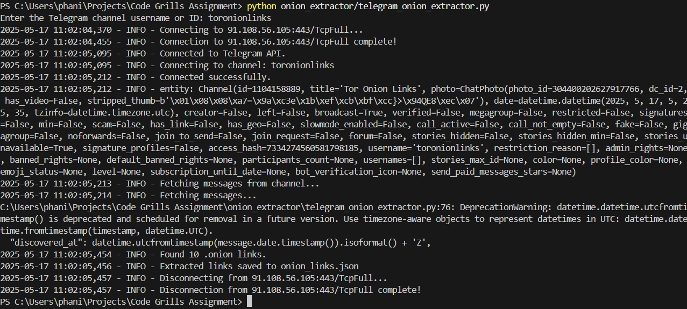

# Telegram .onion Link Extractor

This script is part of the larger project located in the root directory. Please refer to the main [README.md](../README.md) for overall project information, setup, and usage instructions.

This script specifically focuses on connecting to a specified Telegram channel, extracting messages, and searching for .onion links within those messages. The extracted links are then saved to a JSON file (`onion_links.json`) in the root directory.

For details on requirements, setup, and usage of this script, please see the [main README.md](../README.md).

## Script Details

*   **Location:** `onion_extractor/telegram_onion_extractor.py`
*   **Input:** Prompts for Telegram channel username or ID during execution.
*   **Output:** Saves extracted .onion links to `onion_links.json` in the root directory.
*   **Logging:** Logs are saved to `extractor.log` in the root directory.

## Proof of Concept Screenshot

