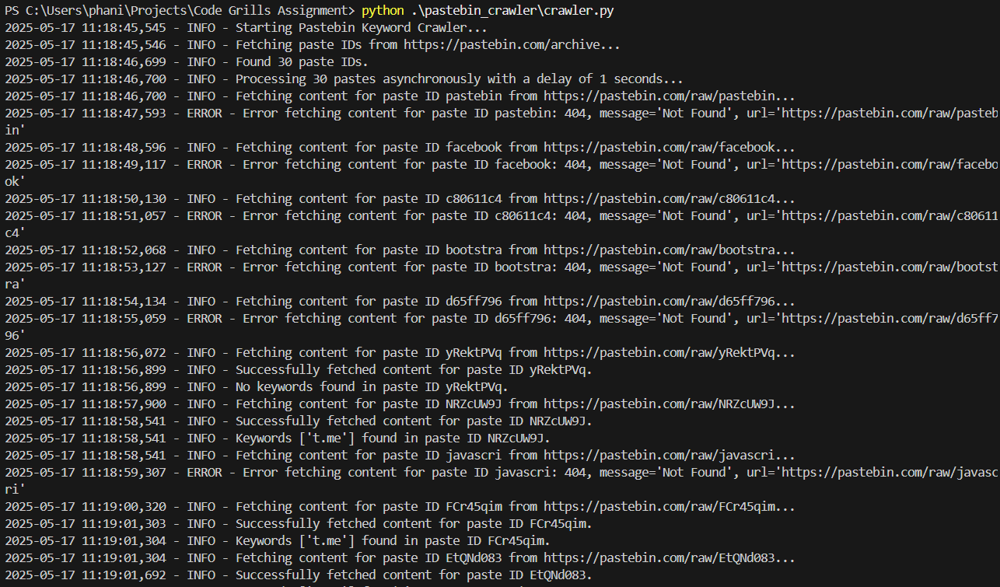
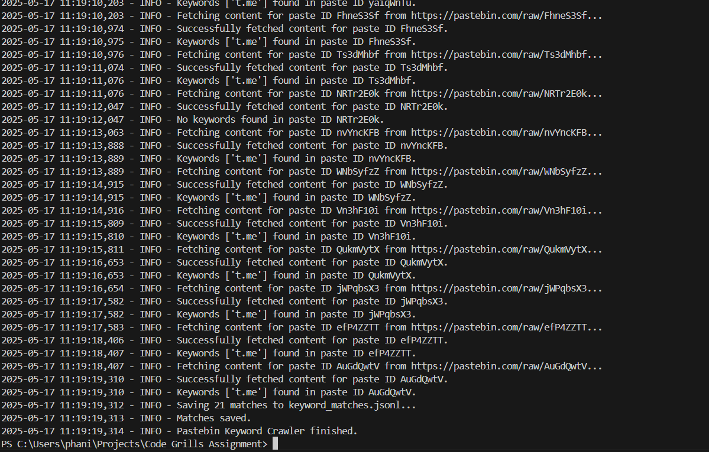

# Pastebin Keyword Crawler

This script is part of the larger project located in the root directory. Please refer to the main [README.md](../README.md) for overall project information, setup, and usage instructions.

This script specifically focuses on scraping Pastebin's public archive for pastes containing predefined keywords related to crypto or Telegram links. Relevant pastes are saved in a JSON Lines format (`keyword_matches.jsonl`) in the root directory.

For details on requirements, setup, and usage of this script, please see the [main README.md](../README.md).

## Script Details

*   **Location:** `pastebin_crawler/crawler.py`
*   **Input:** Searches for keywords defined within the script.
*   **Output:** Saves matching pastes to `keyword_matches.jsonl` in the root directory.
*   **Logging:** Logs are saved to `crawler.log` in the root directory.

## Customization

You can modify the `KEYWORDS` list in `pastebin_crawler/crawler.py` to add or remove keywords you want to search for.

## Proof of concept Screenshots

